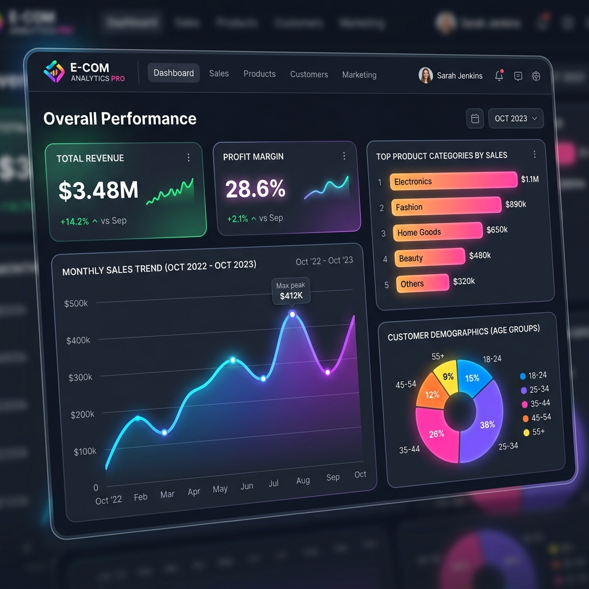

# 📊 Power BI Dashboard (Phase 9)

Thư mục này chứa file `.pbix` (File Power BI) và các hình ảnh chụp giao diện Dashboard (Mockups) cho dự án E-Commerce Analytics.

## 🖼️ Giao diện Dashboard (Mockup)
Bản phác thảo giao diện Dashboard với phong cách Dark-Mode hiện đại (Glassmorphism), mang lại cảm giác cực kỳ chuyên nghiệp (Premium) cho các báo cáo doanh nghiệp.



---

## 🛠️ Hướng dẫn Xây dựng (Development Guide)
Khi bạn mở file Power BI Desktop để tự thiết kế Dashboard dựa trên kho dữ liệu SQL Server đã tạo, hãy tuân thủ nghiêm ngặt mô hình Dữ liệu và các công thức DAX dưới đây.

### 1. Data Modeling (Mô hình Dữ liệu)
Sử dụng kiến trúc **Star Schema** (Lược đồ hình sao) với 1 bảng Fact ở trung tâm nối với 3 bảng Dimension:
- `fact_sales[customer_id]` ➔ `dim_customer[customer_id]` (1-to-Many, Single Direction)
- `fact_sales[product_id]` ➔ `dim_product[product_id]` (1-to-Many, Single Direction)
- `fact_sales[date_id]` ➔ `dim_date[date_id]` (1-to-Many, Single Direction)

### 2. Các công thức DAX cốt lõi (Measures)

**Tính Tổng Doanh thu:**
```dax
Total Revenue = SUM(fact_sales[sales])
```

**Tính Tổng Lợi nhuận:**
```dax
Total Profit = SUM(fact_sales[profit])
```

**Biên Lợi Nhuận (Profit Margin %):**
```dax
Profit Margin % = DIVIDE([Total Profit], [Total Revenue], 0)
```

**Doanh thu lũy kế năm (YTD Revenue):**
```dax
YTD Revenue = CALCULATE([Total Revenue], DATESYTD(dim_date[date_id]))
```

**Tốc độ tăng trưởng tháng (MoM Growth):**
```dax
MoM Revenue Growth % = 
VAR PrevMonthRev = CALCULATE([Total Revenue], PREVIOUSMONTH(dim_date[date_id]))
RETURN DIVIDE([Total Revenue] - PrevMonthRev, PrevMonthRev, 0)
```

### 3. Cấu trúc Biểu đồ (Visuals) đề xuất
1. **Cards (Thẻ KPI):** Đặt ở trên cùng để làm nổi bật các chỉ số sinh tồn (`Total Revenue`, `Total Profit`, `Profit Margin`, `Total Orders`).
2. **Line Chart:** Vẽ đường `Total Revenue` và `Total Profit` theo chuỗi thời gian (`Order_Date`). Giúp trực quan hóa xu hướng mùa vụ.
3. **Bar Chart (Biểu đồ cột ngang):** `Total Profit` chia theo ngành hàng (`Product_Category`).
4. **Donut Chart:** Tỷ lệ phần trăm doanh thu chia theo thiết bị truy cập (`Device_Type`) hoặc Giới tính (`Gender`).
5. **Matrix (Bảng ma trận):** Liệt kê danh sách Top 10 khách hàng chi tiêu nhiều nhất (VIP) kết hợp Color Conditional Formatting.
