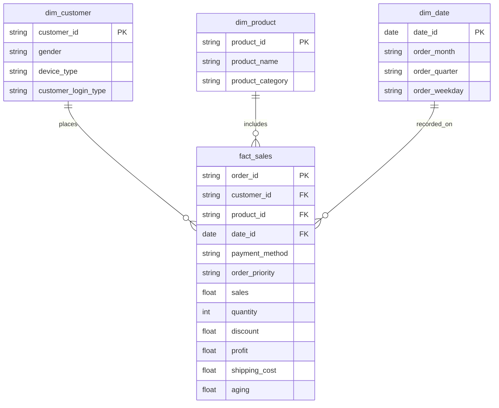

# Phase 3 - Data Modeling & Star Schema Design

## 1. Tổng quan (Overview)

Trong các dự án phân tích dữ liệu thực tế, dữ liệu thô thường được lưu trữ dưới dạng một "bảng phẳng" (Flat File - như file CSV chúng ta xử lý ở Phase 2) chứa tất cả thông tin lẫn lộn: từ thông tin khách hàng, sản phẩm đến chi tiết doanh thu. 

Tuy nhiên, khi đưa vào **Data Warehouse (Kho dữ liệu)** và **Power BI**, việc giữ nguyên bảng phẳng này sẽ gây ra nhiều vấn đề:
- **Dư thừa dữ liệu (Data Redundancy):** Tên sản phẩm, ngành hàng, hay thông tin khách hàng bị lặp lại hàng nghìn lần ở mỗi đơn hàng.
- **Hiệu suất kém (Poor Performance):** Khi bảng chứa hàng triệu dòng, việc truy vấn (query) hoặc tính toán sẽ trở nên rất chậm.
- **Khó khăn khi mở rộng (Scalability):** Khó kết hợp thêm dữ liệu mới (VD: bảng kế toán ngân sách, bảng chi phí marketing).

Để giải quyết, dự án này áp dụng **Star Schema (Lược đồ hình sao)** - "tiêu chuẩn vàng" trong thiết kế Data Warehouse. Chúng ta sẽ "bóc tách" (Normalize) dữ liệu sạch ở Phase 2 thành 1 bảng **Fact (Sự kiện)** nằm ở trung tâm và 3 bảng **Dimension (Chiều phân tích)** bao xung quanh.

---

## 2. Sơ đồ Thực thể Liên kết - Entity Relationship Diagram (ERD)

Dưới đây là sơ đồ mô tả cấu trúc cơ sở dữ liệu sẽ được triển khai trong cơ sở dữ liệu (Database) ở các phase tiếp theo:

---

## 3. Chi tiết Cấu trúc Bảng (Data Dictionary)

### 3.1. Bảng `dim_customer` (Dimension Table - Khách hàng)
Bảng này đóng vai trò như hồ sơ khách hàng (Customer Profile).
- `customer_id` (Primary Key): Mã định danh duy nhất của khách hàng.
- `gender`: Giới tính khách hàng.
- `device_type`: Thiết bị sử dụng khi mua sắm (Web/Mobile).
- `customer_login_type`: Loại tài khoản đăng nhập (Member, Guest,...).

### 3.2. Bảng `dim_product` (Dimension Table - Sản phẩm)
Lưu trữ thông tin chi tiết về hàng hóa. Do dữ liệu gốc chỉ có tên sản phẩm dạng Text, chúng ta sẽ cần tạo thêm một mã định danh giả (`Surrogate Key`) để làm khóa chính.
- `product_id` (Primary Key): Mã định danh sản phẩm (Tự động tạo ra bằng mã băm MD5 hoặc hàm cấp số tuần tự trong quá trình ETL).
- `product_name`: Tên sản phẩm.
- `product_category`: Danh mục ngành hàng.

### 3.3. Bảng `dim_date` (Dimension Table - Thời gian)
Bảng lịch (Calendar table) là thành phần bắt buộc trong bất kỳ Data Warehouse nào, đóng vai trò cực kỳ quan trọng để phân tích chuỗi thời gian (Time Intelligence) trên Power BI.
- `date_id` (Primary Key): Ngày đặt hàng (Định dạng Date).
- `order_month`: Tháng diễn ra giao dịch (VD: 2018-01).
- `order_quarter`: Quý diễn ra giao dịch (VD: Q1-2018).
- `order_weekday`: Thứ trong tuần (Monday, Tuesday,...).

### 3.4. Bảng `fact_sales` (Fact Table - Bảng Sự kiện / Giao dịch)
Đây là bảng cốt lõi (nằm ở giữa "ngôi sao"), chứa các **Khóa ngoại (Foreign Key)** trỏ tới các bảng Dimension và các **Chỉ số đo lường (Measures/Metrics)**.
- **Foreign Keys:** `customer_id`, `product_id`, `date_id`.
- **Primary Key:** `order_id` (Đã được tạo ở Phase 2).
- **Degenerate Dimensions (Chiều suy biến):** `payment_method`, `order_priority` (Được lưu trực tiếp trong Fact table vì số lượng giá trị ít, và gắn liền với ngữ cảnh đơn hàng, không cần thiết phải tách thành bảng riêng).
- **Measures (Chỉ số định lượng kinh doanh):** `sales`, `quantity`, `discount`, `profit`, `shipping_cost`, `aging`.

---

## 4. Quyết định Thiết kế (Design Decisions) & Tác động thực tế

1. **Chuẩn hóa 3NF (3rd Normal Form):** Việc loại bỏ thông tin `product_name` và `product_category` ra khỏi bảng giao dịch giúp giảm đáng kể dung lượng lưu trữ của database. Hơn nữa, nếu có sự thay đổi về tên Category trong tương lai, Data Engineer chỉ cần update 1 dòng duy nhất trong bảng `dim_product` thay vì phải chạy vòng lặp sửa hàng nghìn dòng trong bảng giao dịch.
2. **Quản lý Identity rác:** Trong Phase tiếp theo (ETL), chúng ta sẽ chủ động sinh ra `product_id` để tối ưu tốc độ Join bảng, thay vì dùng tên sản phẩm dạng `String` làm khóa chính (rất tốn tài nguyên và dễ lỗi do dấu cách, in hoa/in thường).
3. **Tối ưu cho Dashboard (Phase 9):** Cấu trúc Star Schema là "bạn thân" của Power BI Model. Data model này sẽ giúp người phân tích viết các hàm DAX (ví dụ: Tính doanh thu lũy kế YTD, phân tích hành vi theo Demographic khách hàng) một cách dễ dàng, và thao tác filter trên báo cáo tương tác sẽ phản hồi cực kỳ mượt mà.

## Bước tiếp theo (Next Steps)
Từ thiết kế bản vẽ này, trong **Phase 4 & 5**, chúng ta sẽ viết kịch bản SQL (SQL Scripts) để tự động khởi tạo các Schema này trong Hệ quản trị Cơ sở dữ liệu (Database) và thiết lập đường ống nạp dữ liệu (ETL Pipeline) từ file CSV sạch vào các bảng đã thiết kế.
